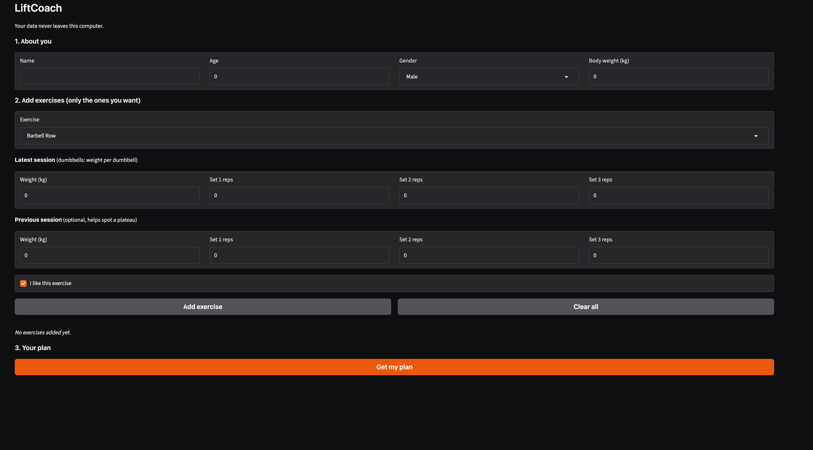

# LiftCoach

A local, private workout progression coach. Enter your profile and your last sessions for the lifts you choose, and LiftCoach tells you the next weight, sets and reps. If you dislike a lift, it suggests swaps that train the same muscles.

Built for the Hacktoberfest 2026 Weekend Challenge: **Build for a Friend**. I built it for Kavya, who lifts same weight for months.



## How it works

| Part | Job |
|---|---|
| **Python rules engine** (`logic.py`) | Decides next weight, reps and sets using double progression. Plain code. |
| **Curated exercise table** (`logic.py`) | 20 exercises tagged by muscle group, movement pattern and equipment. Picks swaps for disliked lifts. |
| **Gemma 3 4B via Ollama** (`app.py`) | An open weight model that only explains the plan in coach language. It never changes the numbers or adds exercises. |
| **Gradio** (`app.py`) | The web form. |

Safety checks: input range validation, plus a body weight sanity check. If a logged weight is far above the typical range for the user's body weight and gender, the plan holds the weight until the input is confirmed.

## Why open-source AI

- Age, body weight and training logs never leave your computer.
- Works offline, for example in a gym with bad signal.
- Free to run.
- The model can be swapped by changing one line (`MODEL` in `app.py`).

## Run it

Requires Python 3 and [Ollama](https://ollama.com).

```
git clone https://github.com/jobs-code/liftcoach.git
cd liftcoach
python3 -m venv venv
source venv/bin/activate        # Windows: venv\Scripts\activate
pip install -r requirements.txt
ollama pull gemma3:4b
python app.py
```

Open the URL it prints (usually http://127.0.0.1:7860).

To use it from a phone on the same Wi-Fi, change the last line of `app.py` to `demo.launch(server_name="0.0.0.0")` and open `http://YOUR_LAPTOP_IP:7860` or To create a public link, set `share=True` in `launch()`. Only do this on a trusted network.

## Example

Profile: Riya, female, 60 kg. Bench press, latest session `60 kg, 12 / 12 / 12`.
Result: the plan holds at 60 kg and flags the input for confirmation, because it is above the typical range for that body weight.

## Limitations

- Fixed at 3 sets per exercise.
- Only 20 exercises in the table (easy to extend by adding rows to `EX`).
- Body weight ratios are rough heuristics based on commonly cited strength-standard tables. They are **not** an official standard, and they are used only to flag inputs worth double checking.
- Progression is a simplified double-progression rule inspired by ACSM/NSCA guidance on gradual load increases.
- The language model can be wordy and occasionally glosses over details, which is why warnings are also shown in their own section generated by plain Python.
- Not medical advice. If something hurts, stop and see a professional. Under-18s should train with supervision.

## Future ideas

- Custom sets and reps per exercise
- More exercises and equipment filters
- Saved history across sessions
- Running the model on a phone

## License

MIT